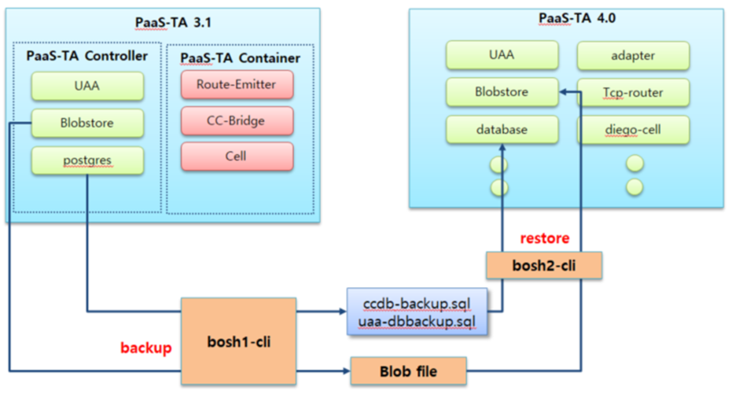

## Table of Contents

1. [Outline](#1)
  * [objective](#2)
  * [range](#3)
2. [Paasta 4.0 version upgrade](#4)
	* [pre-requsite](#5)
	* [paasta-3.1 backup](#6)
    * [ccdb, uaadb backup (standard bosh cli 1)](#7)
    * [blobstore backup](#8)
    * [ccdb, uaadb datafile edit](#9)
	* [paasta-4.0 restore](#10)
    * [pre-requisite](#11)
    * [blob-store recovery](#12)
    * [uaa database recovery](#13)
    * [cloud_controller database recovery](#14)
    * [Check Apps and Uesrs](#15)

# <div id='1'/>1. Document Outline

## <div id='2'/>1.1.  Objective
This document (installation guide) is for upgrading pasta from version 3.1 to 4.0.

## <div id='3'/>1.2.  Range
This document (installation guide) is intended to guide how to upgrade pasta from version 3.1 to 4.0.


# <div id='4'/>2. Paasta 4.0 version upgrade
In Paasta 4.0, unlike versions before 3.1, the distribution and version upgrade methods were changed. Until Paasta 3.1, the version was upgraded based on cf-release. but since cf-release 287, It has changed that bosh of cloud-foundry and cf deployment methods 
Bosh deployed bosh based on bosh-deployment, cloud-foundry distributed cf based on cf-deployment. Cli was also changed from bosh-cli1 to bosh-cli2. In Bosh-cli2 it was also changed existing bosh cli command.


To upgrade from paasta-3.1 to 4.0, it cannot be upgraded with the existing method. The purpose of this guide is to migrate existing App and user/organization information when upgrading from paasta-3.1 to 4.0.

If you will migrate to Paasta 4.0, you need to bakcup the ccdb, uaadb and blobstore data and restore them.





## <div id='5'/>2.1.	pre-requsite

1.	During the backup and restore process, there should be no users using paasta.
2.	3.1 and 4.0 must have the same system domain.
3.	cf_admin_password should be the same as version 3.1.
4.	When installing paasta-4.0, the value in db_encryption_key in Paasta-3.1 Paasta-controller.yml should be the same.
5.	The bosh cli standard of paasta-3.1 Backup is bosh1, and the paasta-4.0 recovery bosh cli standard is bosh2.


### <div id='6'/>2.2.	paasta-3.1 backup

Backup the database and blobstore data on the vm installed with paasta-3.1.


### <div id='7'/>2.2.1.	ccdb, uaadb backup (bosh cli 1 Standard)

```
$ bosh ssh postgres_z1/0   #postgres database vm access
$ sudo su –
$ cd /var/vcap/packages/postgres_x.x.x/bin/
$ ./pg_dump -U ccadmin -p 5524 -d ccdb --data-only --column-inserts > /tmp/ccdb-data.sql     # ccdb database backup (User, Org, Space, app meta data)
./pg_dump -U uaaadmin -p 5524 -d uaadb --data-only --column-inserts > /tmp/uaadb-data.sql    # uaadb database backup (Users information meta data)

$ exit
$ exit   # t comes from postgres vm.

$ bosh scp postgres_z1/0 --download  /tmp/ccdb-data.sql  {download_path}
$ bosh scp postgres_z1/0 --download  /tmp/uaadb-data.sql  {download_path}
$ cd {download_path}
$ mv ccdb-data.sql.postgres_z1.0 ccdb-data.sql
$ mv uaadb-data.sql.postgres_z1.0 uaadb-data.sql

```
### <div id='8'/>2.2.2.	blobstore backup

```
$ bosh ssh blobstore_z1/0   #blobstore_z1 vm access
$ sudo su -
$ cd /var/vcap/store  
$ sudo tar cvf blobstore.tar shared/
$ sudo mv blobstore.tar /tmp/

$ exit
$ exit   # It comes from the blobstore vm.

$ bosh scp blobstore_z1/0 /tmp/blobstore.tar {download_path} –download  (It takes time depending on app capacity)

$ mv blobstore.tar.blobstore_z1.o blobstore.tar
```

### <div id='9'/>2.2.3.	ccdb, uaadb datafile edit


1)	Open the uaadb-data.sql File and then
Delete"identity_zone, identity_provider, schema_migrations Table insert" 

2)	Open the ccdb-data.sql File and then
Delete"schema_migrations Table insert" 


## <div id='10'/>2.3.	paasta-4.0 restore (bosh2 cli Standard)

### <div id='11'/>2.3.1.	pre-requisite

-	The bosh cli used in recover is bosh2.
-	paasta-4.0 must be installed.
-	System domain should be the same as before.
-	Cf_admin_password should be the same as before. 
-	It should be same that value in db_encryption_key in Paasta-Controller.yml when installing PaaS-TA 4.0 
-	You need to recover on paasta-4.0 was installed (no app or user).
-	When recovering, follow the procedure below.

### <div id='12'/>2.3.2.	blob-store recovery

After logging in to bosh cli, execute the following command.
```
$ bosh -e {director_name} -d paasta scp {blob_file_path}/blobstore.tar singleton-blobstore:/tmp   #blob file upload

$ bosh -e {director_name}  -d paasta ssh singleton-blobstore  #blobstore vm access
$ sudo su - 
$ cd /tmp/
$ mv blobstore.tar /var/vcap/store
$ cd /var/vcap/store
$ rm -rf shared/cc-buildpacks/
$ tar xvf blobstore.tar
$ cd shared

$ mv xx.xxx.xx.xx.xip.io-cc-buildpacks/ cc-buildpacks   (Change Directory Name)
$ mv xx.xxx.xx.xx.xip.io-cc-resources cc-resources
$ mv xx.xxx.xx.xx.xip.io-cc-packages cc-packages
$ mv xx.xxx.xx.xx.xip.io-cc-droplets cc-droplets
$ exit
$ exit    # It comes from blobstore vm..
```

### <div id='13'/>2.3.3.	uaa database recovery
uaa keeps user information and credentials.

```
$ bosh -e {director_name} -d paasta ssh database  #database vm access
$ cd /var/vcap/packages/postgres-x.x.x/bin/
$ ./psql -h 127.0.0.1 -p 5524 -U uaa -W uaa (password is uaa_database_password set up when paasta was deployed.)

Database login
# delete from external_group_mapping;
# delete from groups;
# delete from group_membership;
# delete from oauth_client_details;
# delete from users where username = 'admin';


Execute the contents of the modified uaadb-data.sql.
#  \q  (postgres exit)

$ exit 
$ exit
```

### <div id='14'/>2.3.4.	cloud_controller database recovery

```
$ bosh -d paasta ssh database
$ cd /var/vcap/packages/postgres-x.x.x/bin/
$ ./psql -h 127.0.0.1 -p 5524 -U cloud_controller -W cloud_controller (The password is cc_database_password set up when paasta was deployed.)

Database login
# delete from buildpacks;
# delete from clock_jobs;
# delete from domains;
# delete from isolation_segments;
# delete from env_groups; 
# delete from lockings;
# delete from spaces;
# delete from organizations;
# delete from quota_definitions;
# delete from stacks;
# delete from users;
# delete from security_groups;

# Execute the contents of the modified ccdb-data.sql.
#  \q  (postgres exit)
$ exit
$ exit
```
Depending on the environment, it may take some time to start an existing application.

### <div id='15'/>2.3.5.	Check users and Apps 

```
$ cf login
$ cf apps 
```


[PaaSTa_Migration_Image]:./images/paasta4.0-migration.png
