## Table of Contents  

1. [문서 개요](#1)  
  1.1. [목적](#1.1)  
  1.2. [범위](#1.2)  
  1.3. [시스템 구성도](#1.3)  
  1.4. [참고자료](#1.4)  
  
2. [On-Demand-Redis 서비스 설치](#2)  
  2.1. [Prerequisite](#2.1)   
  2.2. [Stemcell 확인](#2.2)    
  2.3. [Deployment 다운로드](#2.3)   
  2.4. [Deployment 파일 수정](#2.4)  
  2.5. [서비스 설치](#2.5)    
  2.6. [서비스 설치 - 다운로드 된 PaaS-TA Release 파일 이용 방식](#2.6)   
  2.7. [서비스 설치 확인](#2.7)  

3. [CF CLI를 이용한 On-Demand-Redis 서비스 브로커 등록](#3)  
  3.1. [PaaS-TA에서 서비스 신청](#3.1)  
  3.2. [Sample App에 서비스 바인드 신청 및 App 확인](#3.2)  

4. [Portal을 이용한 Redis Service Test](#4)  
  4.1. [서비스 신청](#4.1)  

5. [Redis Client 툴 접속](#5)  
  5.1. [Redis Desktop Manager 설치 및 연결](#5.1)  
  


## <div id='1'> 1. 문서 개요

### <div id='1.1'> 1.1. 목적
본 문서(Redis 서비스팩 설치 가이드)는 전자정부표준프레임워크 기반의 PaaS-TA에서 제공되는 서비스팩인 Redis 서비스팩을 Bosh를 이용하여 설치하는 방법과 PaaS-TA의 SaaS 형태로 제공하는 Application에서 Redis 서비스를 사용하는 방법을 기술하였다.

### <div id='1.2'> 1.2. 범위
설치 범위는 Redis서비스팩을 검증하기 위한 기본 설치를 기준으로 작성하였다.

### <div id='1.3'> 1.3. 시스템 구성도
본 문서의 설치된 시스템 구성도이다. Redis, MariaDB, On-Demand 서비스 브로커로 최소사항을 구성하였다.

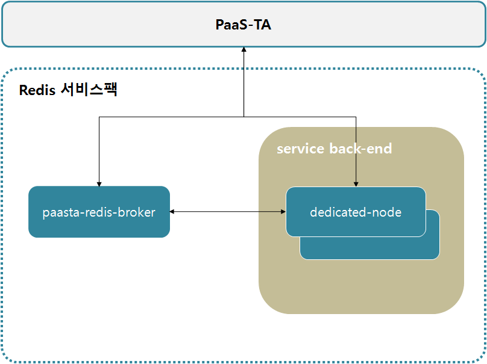

<table>
  <tr>
    <td>구분</td>
    <td>스펙</td>
  </tr>
  <tr>
    <td>on-demand-service-broker</td>
    <td>1vCPU / 1GB RAM / 4GB Disk</td>
  </tr>
  <tr>
      <td>Mariadb</td>
      <td>1vCPU / 256MB RAM / 4GB Disk+2GB(영구적 Disk)</td>
    </tr>
  <tr>
    <td>Redis</td>
    <td>1vCPU / 256MB RAM / 4GB Disk+1GB(영구적 Disk)</td>
  </tr>
</table>

### <div id='1.4'> 1.4. 참고자료
[**http://bosh.io/docs**](http://bosh.io/docs) <br>
[**http://docs.cloudfoundry.org/**](http://docs.cloudfoundry.org/)


## <div id='2'>  2. On-Demand Redis 서비스 설치
	
### <div id="2.1"/> 2.1. Prerequisite  

본 설치 가이드는 Linux 환경에서 설치하는 것을 기준으로 하였다. 서비스 설치를 위해서는 BOSH 2.0과 PaaS-TA 5.0 이상, PaaS-TA 포털이 설치되어 있어야 한다. 

### <div id="2.2"/> 2.2. Stemcell 확인

Stemcell 목록을 확인하여 서비스 설치에 필요한 Stemcell이 업로드 되어 있는 것을 확인한다.  (PaaS-TA 5.5.1 과 동일 stemcell 사용)

> $ bosh -e micro-bosh stemcells

```
Using environment '10.0.1.6' as client 'admin'

Name                                     Version  OS             CPI  CID  
bosh-aws-xen-hvm-ubuntu-xenial-go_agent  621.94*  ubuntu-xenial  -    ami-0297ff649e8eea21b  

(*) Currently deployed

1 stemcells

Succeeded
```

### <div id="2.3"/> 2.3. Deployment 다운로드  

서비스 설치에 필요한 Deployment를 Git Repository에서 받아 서비스 설치 작업 경로로 위치시킨다.  

- Service Deployment Git Repository URL : https://github.com/PaaS-TA/service-deployment/tree/v5.0.6

```
# Deployment 다운로드 파일 위치 경로 생성 및 설치 경로 이동
$ mkdir -p ~/workspace/paasta-5.5.1/deployment
$ cd ~/workspace/paasta-5.5.1/deployment

# Deployment 파일 다운로드
$ git clone https://github.com/PaaS-TA/service-deployment.git -b v5.0.6

# common_vars.yml 파일 다운로드(common_vars.yml가 존재하지 않는다면 다운로드)
$ git clone https://github.com/PaaS-TA/common.git
```

### <div id="2.4"/> 2.4. Deployment 파일 수정

BOSH Deployment manifest는 Components 요소 및 배포의 속성을 정의한 YAML 파일이다.
Deployment 파일에서 사용하는 network, vm_type, disk_type 등은 Cloud config를 활용하고, 활용 방법은 BOSH 2.0 가이드를 참고한다.   

- Cloud config 설정 내용을 확인한다.   

> $ bosh -e micro-bosh cloud-config   

```
Using environment '10.0.1.6' as client 'admin'

azs:
- cloud_properties:
    availability_zone: ap-northeast-2a
  name: z1
- cloud_properties:
    availability_zone: ap-northeast-2a
  name: z2

... ((생략)) ...

disk_types:
- disk_size: 1024
  name: default
- disk_size: 1024
  name: 1GB

... ((생략)) ...

networks:
- name: default
  subnets:
  - az: z1
    cloud_properties:
      security_groups: paasta-security-group
      subnet: subnet-00000000000000000
    dns:
    - 8.8.8.8
    gateway: 10.0.1.1
    range: 10.0.1.0/24
    reserved:
    - 10.0.1.2 - 10.0.1.9
    static:
    - 10.0.1.10 - 10.0.1.120

... ((생략)) ...

vm_types:
- cloud_properties:
    ephemeral_disk:
      size: 3000
      type: gp2
    instance_type: t2.small
  name: minimal
- cloud_properties:
    ephemeral_disk:
      size: 10000
      type: gp2
    instance_type: t2.small
  name: small

... ((생략)) ...

Succeeded
```

- common_vars.yml을 서버 환경에 맞게 수정한다. 
- redis에서 사용하는 변수는 bosh_url, bosh_client_admin_id, bosh_client_admin_secret, bosh_director_port, bosh_oauth_port, system_domain, paasta_admin_username, paasta_admin_password, bosh_version 이다.

> $ vi ~/workspace/paasta-5.5.1/deployment/common/common_vars.yml
```
# BOSH INFO
bosh_ip: "10.0.1.6"				# BOSH IP
bosh_url: "https://10.0.1.6"			# BOSH URL (e.g. "https://00.000.0.0")
bosh_client_admin_id: "admin"			# BOSH Client Admin ID
bosh_client_admin_secret: "ert7na4jpew48"	# BOSH Client Admin Secret('echo $(bosh int ~/workspace/paasta-5.5.1/deployment/paasta-deployment/bosh/{iaas}/creds.yml --path /admin_password)' 명령어를 통해 확인 가능)
bosh_director_port: 25555			# BOSH director port
bosh_oauth_port: 8443				# BOSH oauth port
bosh_version: 271.2				# BOSH version('bosh env' 명령어를 통해 확인 가능, on-demand service용, e.g. "271.2")

# PAAS-TA INFO
system_domain: "61.252.53.246.xip.io"		# Domain (xip.io를 사용하는 경우 HAProxy Public IP와 동일)
paasta_admin_username: "admin"			# PaaS-TA Admin Username
paasta_admin_password: "admin"			# PaaS-TA Admin Password
paasta_nats_ip: "10.0.1.121"
paasta_nats_port: 4222
paasta_nats_user: "nats"
paasta_nats_password: "7EZB5ZkMLMqT73h2Jh3UsqO"	# PaaS-TA Nats Password (CredHub 로그인후 'credhub get -n /micro-bosh/paasta/nats_password' 명령어를 통해 확인 가능)
paasta_nats_private_networks_name: "default"	# PaaS-TA Nats 의 Network 이름
paasta_database_ips: "10.0.1.123"		# PaaS-TA Database IP (e.g. "10.0.1.123")
paasta_database_port: 5524			# PaaS-TA Database Port (e.g. 5524(postgresql)/13307(mysql)) -- Do Not Use "3306"&"13306" in mysql
paasta_database_type: "postgresql"                      # PaaS-TA Database Type (e.g. "postgresql" or "mysql")
paasta_database_driver_class: "org.postgresql.Driver"   # PaaS-TA Database driver-class (e.g. "org.postgresql.Driver" or "com.mysql.jdbc.Driver")
paasta_cc_db_id: "cloud_controller"		# CCDB ID (e.g. "cloud_controller")
paasta_cc_db_password: "cc_admin"		# CCDB Password (e.g. "cc_admin")
paasta_uaa_db_id: "uaa"				# UAADB ID (e.g. "uaa")
paasta_uaa_db_password: "uaa_admin"		# UAADB Password (e.g. "uaa_admin")
paasta_api_version: "v3"

# UAAC INFO
uaa_client_admin_id: "admin"			# UAAC Admin Client Admin ID
uaa_client_admin_secret: "admin-secret"		# UAAC Admin Client에 접근하기 위한 Secret 변수
uaa_client_portal_secret: "clientsecret"	# UAAC Portal Client에 접근하기 위한 Secret 변수

# Monitoring INFO
metric_url: "10.0.161.101"			# Monitoring InfluxDB IP
syslog_address: "10.0.121.100"            	# Logsearch의 ls-router IP
syslog_port: "2514"                          	# Logsearch의 ls-router Port
syslog_transport: "relp"                        # Logsearch Protocol
saas_monitoring_url: "61.252.53.248"	   	# Pinpoint HAProxy WEBUI의 Public IP
monitoring_api_url: "61.252.53.241"        	# Monitoring-WEB의 Public IP

### Portal INFO
portal_web_user_ip: "52.78.88.252"
portal_web_user_url: "http://portal-web-user.52.78.88.252.xip.io" 

### ETC INFO
abacus_url: "http://abacus.61.252.53.248.xip.io"	# abacus url (e.g. "http://abacus.xxx.xxx.xxx.xxx.xip.io")

```


- Deployment YAML에서 사용하는 변수 파일을 서버 환경에 맞게 수정한다.

> $ vi ~/workspace/paasta-5.5.1/deployment/service-deployment/redis/vars.yml
```
# STEMCELL
stemcell_os: "ubuntu-xenial"                                      # Deployment Main Stemcell OS
stemcell_version: "621.94"                                        # Main Stemcell Version

# NETWORK
private_networks_name: "default"                                  # private network name

# MARIA DB
mariadb_azs: [z5]                                                 # mariadb azs
mariadb_instances: 1                                              # mariadb instances 
mariadb_vm_type: "medium"                                         # mariadb vm type
mariadb_persistent_disk_type: "2GB"                               # mariadb persistent disk type
mariadb_user_password: "admin"                                    # mariadb admin password
mariadb_port: 3306                                                # mariadb port (default : 3306)

# ON DEMAND BROKER
broker_azs: [z5]                                                  # broker azs
broker_instances: 1                                               # broker instances 
broker_vm_type: "service_medium"                                  # broker vm type

# PROPERTIES
broker_server_port: 8080                                          # broker server port

### On-Demand Dedicated Service Instance Properties ###
on_demand_service_instance_name: "redis"                          # On-Demand Service Instance Name
service_password: "admin"                                         # On-Demand Redis Service password
service_port: 6379                                                # On-Demand Redis Service port

# SERVICE PLAN INFO
service_instance_guid: "54e2de61-de84-4b9c-afc3-88d08aadfcb6"            # Service Instance Guid
service_instance_name: "redis"                                           # Service Instance Name
service_instance_bullet_name: "Redis Dedicated Server Use"               # Service Instance bullet Name
service_instance_bullet_desc: "Redis Service Using a Dedicated Server"   # Service Instance bullet에 대한 설명을 입력
service_instance_plan_guid: "2a26b717-b8b5-489c-8ef1-02bcdc445720"       # Service Instance Plan Guid
service_instance_plan_name: "dedicated-vm"                               # Service Instance Plan Name
service_instance_plan_desc: "Redis service to provide a key-value store" # Service Instance Plan에 대한 설명을 입력
service_instance_org_limitation: "-1"                                    # Org에 설치할수 있는 Service Instance 개수를 제한한다. (-1일경우 제한없음)
service_instance_space_limitation: "-1"                                  # Space에 설치할수 있는 Service Instance 개수를 제한한다. (-1일경우 제한없음)
```

### <div id="2.5"/> 2.5. 서비스 설치

- 서버 환경에 맞추어 Deploy 스크립트 파일의 VARIABLES 설정을 수정하고, Option file을 추가할지 선택한다.  
     (선택) -o operations/use-compiled-releases.yml (ubuntu-xenial/621.94로 컴파일 된 릴리즈 사용)

> $ vi ~/workspace/paasta-5.5.1/deployment/service-deployment/redis/deploy.sh

```
#!/bin/bash

# VARIABLES
COMMON_VARS_PATH="<COMMON_VARS_FILE_PATH>"	# common_vars.yml File Path (e.g. ../../common/common_vars.yml)
BOSH_ENVIRONMENT="${BOSH_ENVIRONMENT}"		# bosh director alias name (PaaS-TA에서 제공되는 create-bosh-login.sh 미 사용시 bosh envs에서 이름을 확인하여 입력)

# DEPLOY
bosh -e ${BOSH_ENVIRONMENT} -n -d redis deploy --no-redact redis.yml \
    -l ${COMMON_VARS_PATH} \
    -l vars.yml
```

- 서비스를 설치한다.  
```
$ cd ~/workspace/paasta-5.5.1/deployment/service-deployment/redis  
$ sh ./deploy.sh  
```  

### <div id="2.6"/> 2.6. 서비스 설치 - 다운로드 된 PaaS-TA Release 파일 이용 방식

- 서비스 설치에 필요한 릴리즈 파일을 다운로드 받아 Local machine의 서비스 설치 작업 경로로 위치시킨다.  
  
  - 설치 릴리즈 파일 다운로드 : [paasta-on-demand-redis-release.tgz](http://45.248.73.44/index.php/s/R6y32CAMEmBiaSx/download)

```
# 릴리즈 다운로드 파일 위치 경로 생성
$ mkdir -p ~/workspace/paasta-5.5.1/release/service

# 릴리즈 파일 다운로드 및 파일 경로 확인
$ ls ~/workspace/paasta-5.5.1/release/service
paasta-on-demand-redis-release-1.1.0.tgz
```
  
- 서버 환경에 맞추어 Deploy 스크립트 파일의 VARIABLES 설정을 수정하고 Option file 및 변수를 추가한다.  
     (추가) -o operations/use-offline-releases.yml (미리 다운받은 offline 릴리즈 사용)  
     (추가) -v releases_dir="<RELEASE_DIRECTORY>"  
     
> $ vi ~/workspace/paasta-5.5.1/deployment/service-deployment/redis/deploy.sh
  
```
#!/bin/bash

# VARIABLES
COMMON_VARS_PATH="<COMMON_VARS_FILE_PATH>"	# common_vars.yml File Path (e.g. ../../common/common_vars.yml)
BOSH_ENVIRONMENT="${BOSH_ENVIRONMENT}"		# bosh director alias name (PaaS-TA에서 제공되는 create-bosh-login.sh 미 사용시 bosh envs에서 이름을 확인하여 입력)

# DEPLOY
bosh -e ${BOSH_ENVIRONMENT} -n -d redis deploy --no-redact redis.yml \
    -l ${COMMON_VARS_PATH} \
    -l vars.yml \
    -v releases_dir="/home/ubuntu/workspace/paasta-5.5.1/release"  
```  

- 서비스를 설치한다.  
```
$ cd ~/workspace/paasta-5.5.1/deployment/service-deployment/redis  
$ sh ./deploy.sh  
```  

### <div id="2.7"/> 2.7. 서비스 설치 확인

설치 완료된 서비스를 확인한다.  

> $ bosh -e micro-bosh -d redis vms  

```
Using environment '10.0.1.6' as client 'admin'

Task 936167. Done

Deployment 'redis'

Instance                                                       Process State  AZ  IPs           VM CID                                   VM Type         Active  
mariadb/e35f3ece-9c34-41f4-a88e-d8365e9b8c70                   running        z3  10.30.255.25  vm-5168ec8d-f42f-40fa-9c3a-8635bf138b0a  service_tiny    true  
paas-ta-on-demand-broker/13c11522-10dd-485c-bb86-3ac5337223d0  running        z3  10.30.255.26  vm-eab6e832-8b7c-49bc-ac04-80258896880d  service_medium  true  

2 vms

Succeeded
```

## <div id='3'> 3. CF CLI를 이용한 On-Demand-Redis 서비스 브로커 등록

Redis 서비스팩 배포가 완료 되었으면 Application에서 서비스 팩을 사용하기 위해서 먼저 On-Demand-Redis 서비스 브로커를 등록해 주어야 한다.
서비스 브로커 등록시에는 PaaS-TA에서 서비스 브로커를 등록할 수 있는 사용자로 로그인하여야 한다


##### 서비스 브로커 목록을 확인한다.

>`$ cf service-brokers`
```
Getting service brokers as admin...

name                     url
paasta-pinpoint-broker  http://10.30.70.82:8080
```


##### On-Demand-Redis 서비스 브로커를 등록한다.
>`$ cf create-service-broker {서비스팩 이름} {서비스팩 사용자ID} {서비스팩 사용자비밀번호} http://{서비스팩 URL(IP)}`
  
  **서비스팩 이름** : 서비스 팩 관리를 위해 PaaS-TA에서 보여지는 명칭이다. 서비스 Marketplace에서는 각각의 API 서비스 명이 보여지니 여기서 명칭은 서비스팩 리스트의 명칭이다.<br>
  **서비스팩 사용자ID** / 비밀번호 : 서비스팩에 접근할 수 있는 사용자 ID입니다. 서비스팩도 하나의 API 서버이기 때문에 아무나 접근을 허용할 수 없어 접근이 가능한 ID/비밀번호를 입력한다.<br>
  **서비스팩 URL** : 서비스팩이 제공하는 API를 사용할 수 있는 URL을 입력한다.

>`$ cf create-service-broker on-demand-redis-service admin cloudfoundry http://10.30.255.26:8080

```
    Creating service broker on-demand-redis-service as admin...
    OK
```

##### 등록된 On-Demand-Redis 서비스 브로커를 확인한다.

>`$ cf service-brokers`
```
Getting service brokers as admin...

name                     url
paasta-pinpoint-broker  http://10.30.70.82:8080
on-demand-redis-service   http://10.30.255.26:8080
```


##### 접근 가능한 서비스 목록을 확인한다.

>`$ cf service-access`
```
Getting service access as admin...
broker: on-demand-redis-service
  service   plan           access   orgs
  redis     dedicated-vm   none

```
서비스 브로커 등록시 최초에는 접근을 허용하지 않는다. 따라서 access는 none으로 설정된다.


##### 특정 조직에 해당 서비스 접근 허용을 할당하고 접근 서비스 목록을 다시 확인한다. (전체 조직)

>`$ cf enable-service-access redis` <br>
>`$ cf service-access`
```
Getting service access as admin...
broker: paasta-redis-broker
  service   plan           access   orgs
  redis     dedicated-vm   all
```

### <div id='3.1'> 3.1. PaaS-TA에서 서비스 신청
Sample App에서 Redis 서비스를 사용하기 위해서는 서비스 신청(Provision)을 해야 한다.
*참고: 서비스 신청시 PaaS-TA에서 서비스를 신청 할 수 있는 사용자로 로그인이 되어 있어야 한다.

##### 먼저 PaaS-TA Marketplace에서 서비스가 있는지 확인을 한다.

>`$  cf marketplace`

```
OK
service   plans          description
redis     dedicated-vm   A paasta source control service for application development.provision parameters : parameters {owner : owner}
```

<br>

##### Marketplace에서 원하는 서비스가 있으면 서비스 신청(Provision)을 한다.

>`$ cf create-service {서비스명} {서비스 플랜} {내 서비스명}`
- **서비스명** : redis로 Marketplace에서 보여지는 서비스 명칭이다.
- **서비스플랜** : 서비스에 대한 정책으로 plans에 있는 정보 중 하나를 선택한다. On-Demand-Redis 서비스는 dedicated-vm만 지원한다.
- **내 서비스명** : 내 서비스에서 보여지는 명칭이다. 이 명칭을 기준으로 환경 설정 정보를 가져온다.


>`$  cf create-service redis dedicated-vm redis`

```
OK

Create in progress. Use 'cf services' or 'cf service redis' to check operation status.

Attention: The plan `dedicated-vm` of service `redis` is not free.  The instance `redis` will incur a cost.  Contact your administrator if you think this is in error.
```


<br>

##### 생성된 Redis 서비스 인스턴스의 status를 확인한다.
 * create in progress인 상태일경우 서비스 준비중이므로 서비스 이용 및 바인드, 삭제가 제한이되므로 create succeeded가 될때까지 기다려야 한다.
>`$ cf service redis`

```
Showing info of service redis in org system / space dev as admin...

name:            redis
service:         redis
tags:            
plan:            dedicated-vm
description:     A paasta source control service for application development.provision parameters : parameters {owner : owner}
documentation:   https://paas-ta.kr
dashboard:       10.30.255.26

Showing status of last operation from service redis...

status:    create in progress
message:   
started:   2019-07-05T05:58:13Z
updated:   2019-07-05T05:58:16Z

There are no bound apps for this service.
```
##### 생성된 Redis 서비스 인스턴스의 status가 create succeeded가 된것을 확인한다.
```
Showing info of service redis in org system / space dev as admin...

name:            redis
service:         redis
tags:            
plan:            dedicated-vm
description:     A paasta source control service for application development.provision parameters : parameters {owner : owner}
documentation:   https://paas-ta.kr
dashboard:       10.30.255.26

Showing status of last operation from service redis...

status:    create succeeded
message:   test
started:   2019-07-05T05:58:13Z
updated:   2019-07-05T06:01:20Z

There are no bound apps for this service.
```

<br>
### on-demand-service를 통해 서비스를 생성할 경우 해당 공간에 security-group 생성 및 자동적으로 할당이 된다.


### Secuirty-group에 redis_[서비스 할당된 space guid] 가 생성된것을 확인한다.
>`$ cf space [space] --guid`
```
$ cf space dev --guid
20bc9b52-c3d5-4cd2-94d9-7f444f9ab464
```

>`$ cf security-groups`
```

Getting security groups as admin...
OK

     name                                         organization   space   lifecycle
#0   abacus                                       abacus-org     dev     running
#1   dns                                          <all>          <all>   running
     dns                                          <all>          <all>   staging
#2   public_networks                              <all>          <all>   running
     public_networks                              <all>          <all>   staging
#3   redis_20bc9b52-c3d5-4cd2-94d9-7f444f9ab464   system         dev     running

```


### <div id='3.2'> 3.2. Sample App에 서비스 바인드 신청 및 App 확인
서비스 신청이 완료되었으면 Sample App 에서는 생성된 서비스 인스턴스를 Bind 하여 App에서 Redis 서비스를 이용한다.
*참고: 서비스 Bind 신청시 PaaS-TA에서 서비스 Bind신청 할 수 있는 사용자로 로그인이 되어 있어야 한다.


##### Sample App 다운 및 manifest.yml을 생성한다.

>`$ git clone https://github.com/pivotal-cf/cf-redis-example-app.git`

>`$ cd cf-redis-example-app`

>`$ cf push redis-example-app --no-start`

```
Creating app with these attributes...
+ name:         redis-example-app
  path:         /home/inception/workspace/user/cheolhan/cf-redis-example-app
  buildpacks:
+   ruby_buildpack
+ instances:    1
+ memory:       256M
  routes:
+   redis-example-app.115.68.47.178.xip.io

Creating app redis-example-app...
Mapping routes...
Comparing local files to remote cache...
Packaging files to upload...
Uploading files...
 5.39 MiB / 5.39 MiB [============================================================================================================================================================================================================================================] 100.00% 2s

Waiting for API to complete processing files...

name:              redis-example-app
requested state:   stopped
routes:            redis-example-app.115.68.47.178.xip.io
last uploaded:     
stack:             
buildpacks:        

type:           web
instances:      0/1
memory usage:   256M
     state   since                  cpu    memory   disk     details
#0   down    2019-11-20T01:02:06Z   0.0%   0 of 0   0 of 0   


```

<br>

##### Sample App에서 생성한 서비스 인스턴스 바인드 신청을 한다.

>`$ cf bind-service redis-example-app redis`

```
Binding service redis to app redis-sample in org system / space dev as admin...
OK
TIP: Use 'cf restage redis-sample' to ensure your env variable changes take effect
```

##### 바인드를 적용하기 위해서 App을 재기동한다.

>`$ cf restart redis-example-app`
```
Waiting for app to start...

name:              redis-example-app
requested state:   started
routes:            redis-example-app.115.68.47.178.xip.io
last uploaded:     Wed 20 Nov 10:12:51 KST 2019
stack:             cflinuxfs3
buildpacks:        ruby

type:            web
instances:       1/1
memory usage:    256M
start command:   bundle exec rackup config.ru -p $PORT
     state     since                  cpu    memory         disk           details
#0   running   2019-11-20T01:13:03Z   0.0%   9.5M of 256M   100.3M of 1G   
 
```


<br>

##### App이 정상적으로 Redis 서비스를 사용하는지 확인한다.

##### curl 로 확인

>`$  export APP=redis-example-app.[CF Domain]`

>`$ curl -X PUT $APP/foo -d 'data=bar' `
```
success
```
>`$ curl -X GET $APP/foo `
```
bar
```
>`$ curl -X DELETE $APP/foo `
```
success
```


<br>

## <div id='4'> 4. Portal을 이용한 Redis Service Test
사용자 및 관리자 포탈이 설치가 되어있으면 포탈을 통해서 레디스 서비스 신청 및 바인드, 테스트가 가능하다.


##### 관리자 포탈에 접속해 서비스 관리의 서비스 브로커 페이지에서 브로커 리스트를 확인한다..

##### On-Demand-Redis 서비스 브로커를 등록한다.


##### 등록된 On-Demand-Redis 서비스 브로커를 확인한다.

##### 서비스관리의 서비스 제어 페이지에서 접근 가능한 서비스 목록을 확인한다.


서비스 브로커 등록시 최초에는 접근을 허용하지 않는다. 따라서 access는 none으로 설정된다.
##### 특정 조직에 해당 서비스 접근 허용을 할당하고 접근 서비스 목록을 다시 확인한다. (전체 조직)


### <div id='4.1'> 4.1. 서비스 신청
사용자 포탈에서 서비스 신청하기 위해서는 관리자 포탈의 카탈로그페이지에서 서비스 등록을 먼저 해주어야 사용이 가능하다.

##### 관리자 포탈의 운영관리의 카탈로그 페이지로 이동해 서비스 등록을 한다.
![7]
앱 바인드 파라미터는 app_guid 자동입력을 추가, 온디멘드 Y 로 설정후 서비스 등록을 진행한다.
##### 사용자 포탈 로그인 후 카탈로그 페이지에서 서비스를 생성한다.
![8]


##### 생성된 Redis 서비스 인스턴스의 status를 확인한다.
Service status : in progress

 
Service status : created succeed


##### 관리자포탈 보안의 시큐리티그룹 페이지로 이동해 redis_[서비스 할당된 space guid] 가 생성된것을 확인한다.


## <div id='5'> 5. Redis Client 툴 접속
Application에 바인딩 된 Redis 서비스 연결정보는 Private IP로 구성되어 있기 때문에 Redis Client 툴에서 직접 연결할 수 없다. 따라서 Redis Client 툴에서 SSH 터널, Proxy 터널 등을 제공하는 툴을 사용해서 연결하여야 한다. 본 가이드는 SSH 터널을 이용하여 연결 하는 방법을 제공하며 Redis Client 툴로써는 오픈 소스인 Redis Desktop Manager로 가이드한다. Redis Desktop Manager 에서 접속하기 위해서 먼저 SSH 터널링할수 있는 VM 인스턴스를 생성해야한다. 이 인스턴스는 SSH로 접속이 가능해야 하고 접속 후 PaaS-TA에 설치한 서비스팩에 Private IP 와 해당 포트로 접근이 가능하도록 시큐리티 그룹을 구성해야 한다. 이 부분은 OpenStack 관리자 및 PaaS-TA 운영자에게 문의하여 구성한다. vsphere 에서 구성한 인스턴스는 공개키(.pem) 로 접속을 해야 하므로 공개키는 운영 담당자에게 문의하여 제공받는다. 참고) 개인키(.ppk)로는 접속이 되지 않는다.


### <div id='5.1'> 5.1. Redis Desktop Manager 설치 및 연결
Redis Desktop Manager 프로그램은 무료로 사용할 수 있는 오픈소스 소프트웨어이다.

##### Redis Desktop Manager를 다운로드 하기 위해 아래 URL로 이동하여 설치파일을 다운로드 한다.
[**http://redisdesktop.com/download**](http://redisdesktop.com/download)
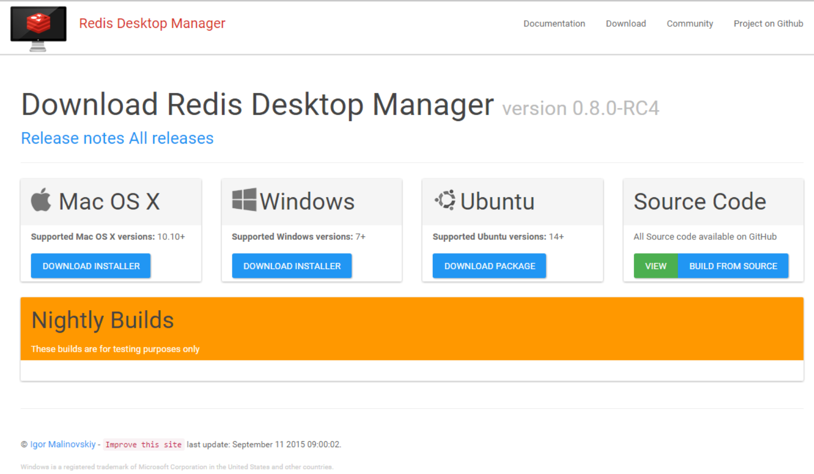

##### 다운로드한 설치파일을 실행한다.
> 

##### Redis Desktop Manager 설치를 위한 안내사항이다. Next 버튼을 클릭한다.
> 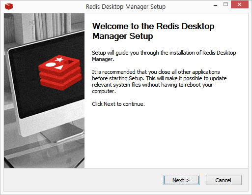

##### 프로그램 라이선스에 관련된 내용이다. I Agree 버튼을 클릭한다.
> 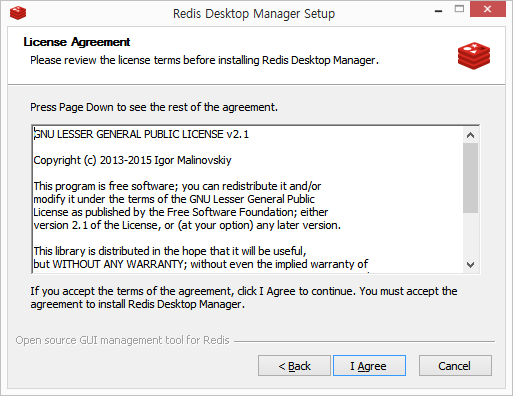

##### Redis Desktop Manager를 설치할 경로를 설정 후 Install 버튼을 클릭한다.
별도의 경로 설정이 필요 없을 경우 default로 C드라이브 Program Files 폴더에 설치가 된다.
> 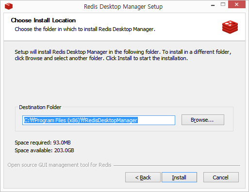

##### 설치 완료 후 Next 버튼을 클릭하여 다음 과정을 진행한다.
> 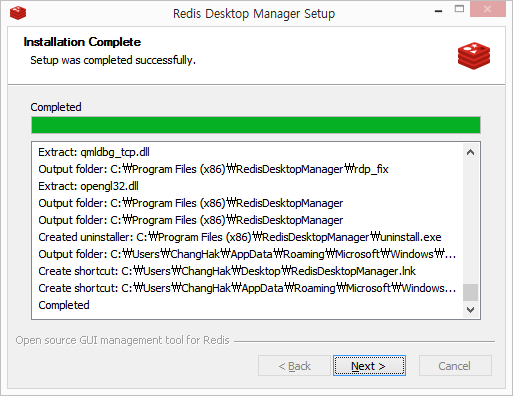

##### Finish 버튼 클릭으로 설치를 완료한다.
> 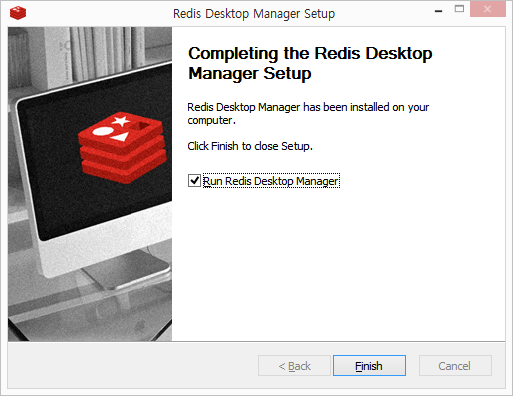

##### Redis Desktop Manager를 실행했을 때 처음 뜨는 화면이다. 이 화면에서 Server에 접속하기 위한 profile을 설정/저장하여 접속할 수 있다. Connect to Redis Server 버튼을 클릭한다.
> 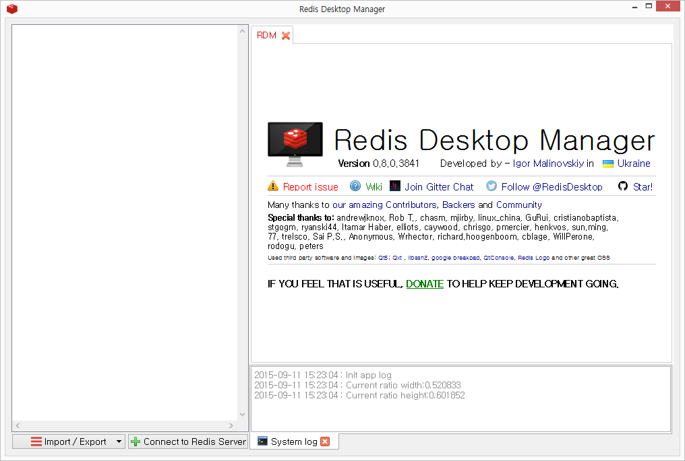

##### Connection 탭에서 아래 붉은색 영역에 접속하려는 서버 정보를 모두 입력한다.
> 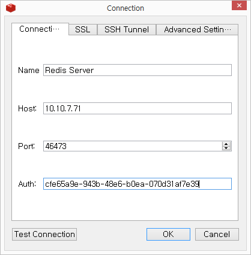

##### 서버 정보는 Application에 바인드 되어 있는 서버 정보를 입력한다. cfenv<app_name> 명령어로 이용하여 확인한다.
예) $ cfenvredis-example-app
> 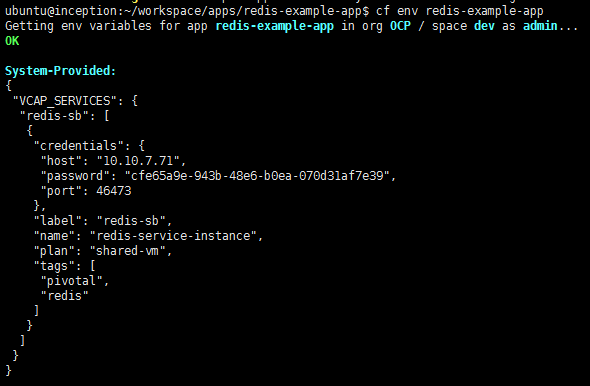

##### SSH Tunnel탭을 클릭하고 PaaS-TA 운영 관리자에게 제공받은 SSH 터널링 가능한 서버 정보를 입력하고 공개키(.pem) 파일을 불러온다. Test Connection 버튼을 클릭하면 Redis 서버에 접속이 되는지 테스트 하고 OK 버튼을 눌러 Redis 서버에 접속한다.
(참고) 만일 공개키 없이 ID/Password로 접속이 가능한 경우에는 공개키 대신 사용자 이름과 암호를 입력한다.
> 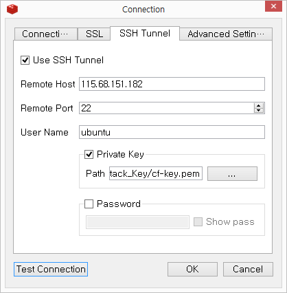

##### 접속이 완료되고 좌측 서버 정보를 더블 클릭하면 좌측에 스키마 정보가 나타난다.
> 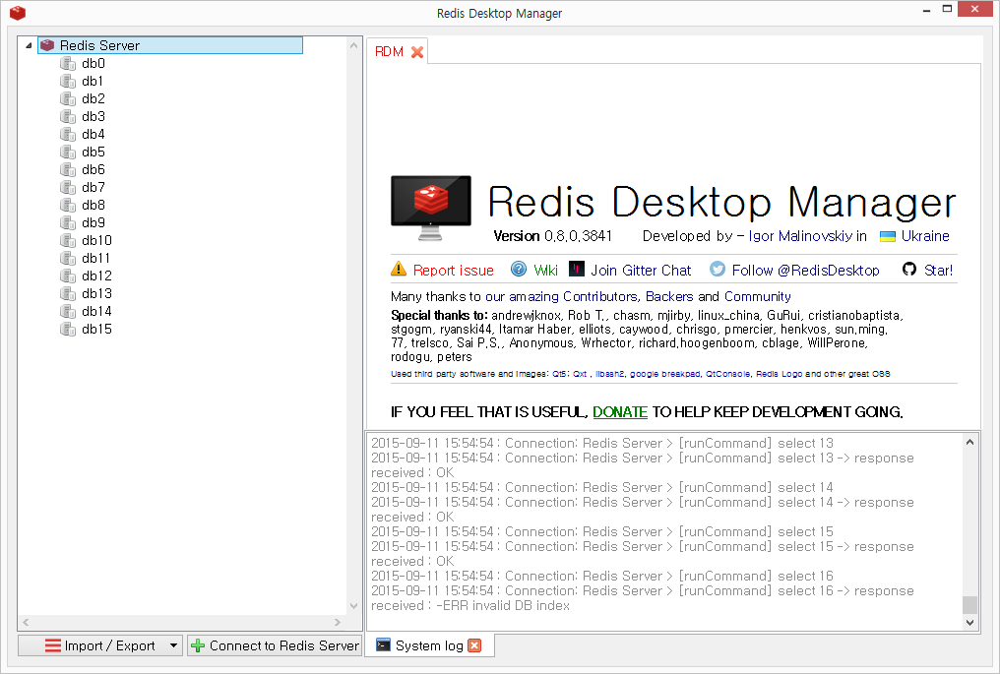

##### 신규 키 등록후 확인
> 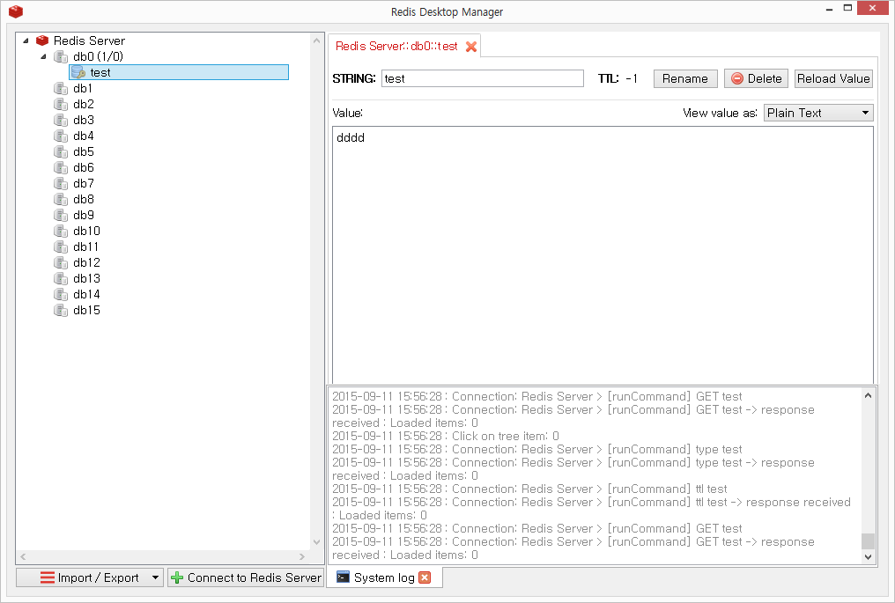

[redis_image_01]:/service-guide/images/redis/redis_image_01.png
[redis_image_02]:/service-guide/images/redis/redis_image_02.png
[redis_image_03]:/service-guide/images/redis/redis_image_03.png
[redis_image_04]:/service-guide/images/redis/redis_image_04.png
[redis_image_05]:/service-guide/images/redis/redis_image_05.png
[redis_image_06]:/service-guide/images/redis/redis_image_06.png
[redis_image_07]:/service-guide/images/redis/redis_image_07.png
[redis_image_08]:/service-guide/images/redis/redis_image_08.png
[redis_image_09]:/service-guide/images/redis/redis_image_09.png
[redis_image_10]:/service-guide/images/redis/redis_image_10.png
[redis_image_11]:/service-guide/images/redis/redis_image_11.png
[redis_image_12]:/service-guide/images/redis/redis_image_12.png
[redis_image_13]:/service-guide/images/redis/redis_image_13.png
[redis_image_14]:/service-guide/images/redis/redis_image_14.png
[redis_image_15]:/service-guide/images/redis/redis_image_15.png
[redis_image_16]:/service-guide/images/redis/redis_image_16.png
[redis_image_17]:/service-guide/images/redis/redis_image_17.png
[redis_image_18]:/service-guide/images/redis/redis_image_18.png
[redis_image_19]:/service-guide/images/redis/redis_image_19.png
[redis_image_20]:/service-guide/images/redis/redis_image_20.png
[redis_image_21]:/service-guide/images/redis/redis_image_21.png
[redis_image_22]:/service-guide/images/redis/redis_image_22.png
[redis_image_23]:/service-guide/images/redis/redis_image_23.png
[redis_image_24]:/service-guide/images/redis/redis_image_24.png
[redis_image_25]:/service-guide/images/redis/redis_image_25.png
[redis_image_26]:/service-guide/images/redis/redis_image_26.png
[1]:/service-guide/images/redis/redis_test1.PNG
[2]:/service-guide/images/redis/redis_test2.PNG
[3]:/service-guide/images/redis/redis_test3.PNG
[4]:/service-guide/images/redis/redis_test4.PNG
[5]:/service-guide/images/redis/redis_test5.PNG
[6]:/service-guide/images/redis/redis_test6.PNG
[7]:/service-guide/images/redis/redis_test7.PNG
[8]:/service-guide/images/redis/redis_test8.PNG
[9]:/service-guide/images/redis/redis_test9.PNG
[10]:/service-guide/images/redis/redis_test10.PNG
[11]:/service-guide/images/redis/redis_test11.PNG


