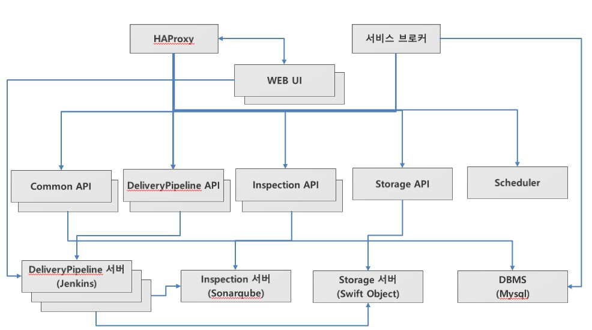
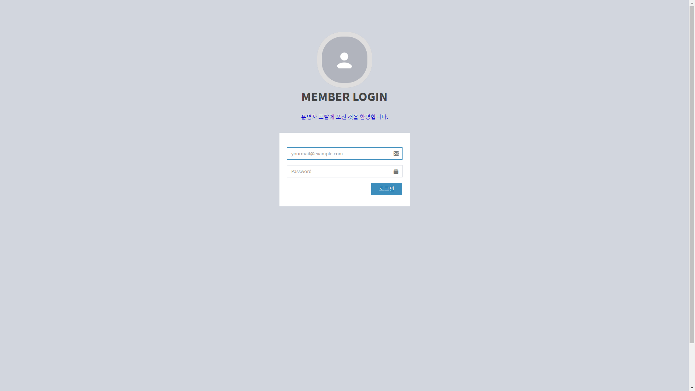
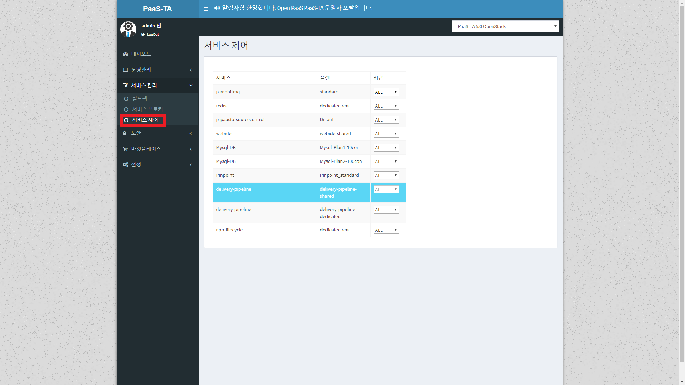
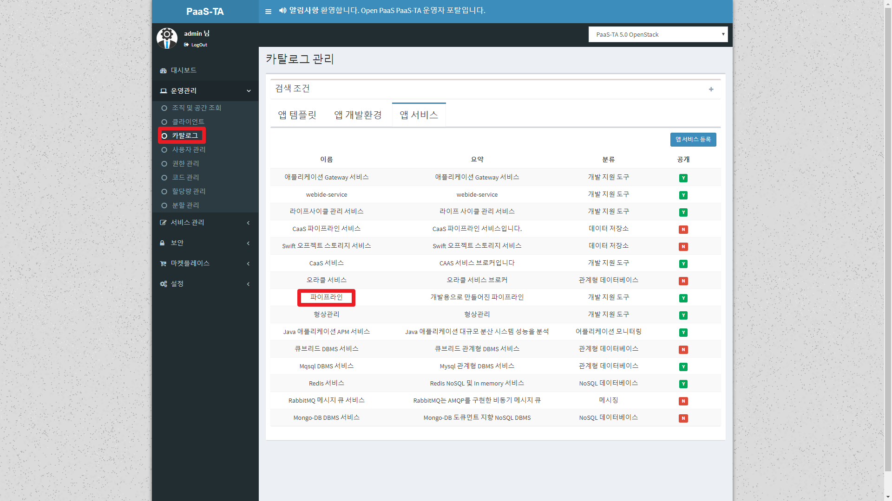

## Table of Contents  

1. [문서 개요](#1)  
  1.1. [목적](#1.1)  
  1.2. [범위](#1.2)  
  1.3. [시스템 구성도](#1.3)  
  1.4. [참고자료](#1.4)  
  
2. [배포 파이프라인 서비스 설치](#2)  
  2.1. [Prerequisite](#2.1)  
  2.2. [Stemcell 확인](#2.2)  
  2.3. [Deployment 다운로드](#2.3)  
  2.4. [Deployment 파일 수정](#2.4)  
  2.5. [서비스 설치](#2.5)    
  2.6. [서비스 설치 - 다운로드 된 PaaS-TA Release 파일 이용 방식](#2.6)   
  2.7. [서비스 설치 확인](#2.7)  
    
3. [배포 파이프라인 서비스 관리 및 신청](#3)  
  3.1. [서비스 브로커 등록](#3.1)  
  3.2. [UAA Client 등록](#3.2)  
  3.3. [Java Offline Buildpack 등록](#3.3)  
  3.4. [서비스 신청](#3.4)  
  3.5. [서비스 신청 - CF CLI](#3.5)  


## <div id='1'/> 1. 문서 개요

### <div id='1.1'/> 1.1. 목적
본 문서(배포 파이프라인 서비스팩 설치 가이드)는 개방형 PaaS 플랫폼 고도화 및 개발자 지원 환경 기반의 Open PaaS에서 제공되는 서비스팩인 배포 파이프라인 서비스팩을 Bosh를 이용하여 설치 및 서비스 등록하는 방법을 기술하였다.
PaaS-TA 3.5 버전부터는 Bosh2.0 기반으로 deploy를 진행하며 기존 Bosh1.0 기반으로 설치를 원할경우에는 PaaS-TA 3.1 이하 버전의 문서를 참고한다.

### <div id='1.2'/> 1.2. 범위
설치 범위는 배포 파이프라인 서비스팩을 검증하기 위한 기본 설치를 기준으로 작성하였다.

### <div id='1.3'/> 1.3. 시스템 구성도
본 문서의 설치된 시스템 구성도이다. 배포 파이프라인 Server, 형상관리 서비스 브로커로 최소사항을 구성하였다.



<table>
  <tr>
    <td>VM 명</td>
    <td>인스턴스 수</td>
		<td>vCPU 수</td>
		<td>메모리(GB)</td>
		<td>디스크(GB)</td>
  </tr>
  <tr>
    <td>HAProxy</td>
    <td>1</td>
	  <td>1</td>
	  <td>2</td>
	  <td>Root 4G</td>
  </tr>
  <tr>
		<td>WEB UI</td>
		<td>N</td>
		<td>1</td>
		<td>2</td>
		<td>Root 4G</td>
  </tr>
	<tr>
		<td>Service broker</td>
		<td>1</td>
		<td>1</td>
		<td>2</td>
		<td>Root 4G</td>
  </tr>
	<tr>
		<td>Common API</td>
		<td>N</td>
		<td>1</td>
		<td>2</td>
		<td>Root 4G</td>
  </tr>
	<tr>
		<td>DeliveryPipeline API</td>
		<td>N</td>
		<td>1</td>
		<td>2</td>
		<td>Root 4G</td>
  </tr>
	<tr>
		<td>Inspection API</td>
		<td>N</td>
		<td>1</td>
		<td>2</td>
		<td>Root 4G</td>
  </tr>
	<tr>
		<td>Storage API</td>
		<td>1</td>
		<td>1</td>
		<td>2</td>
		<td>Root 4G</td>
  </tr>
	<tr>
		<td>Scheduler</td>
		<td>1</td>
		<td>1</td>
		<td>2</td>
		<td>Root 4G</td>
  </tr>
	<tr>
		<td>DeliveryPipeline</td>
		<td>N</td>
		<td>1</td>
		<td>2</td>
		<td>Root 8G + 영구디스크 10G</td>
  </tr>
	<tr>
		<td>Inspection</td>
		<td>1</td>
		<td>1</td>
		<td>2</td>
		<td>Root 4G</td>
  </tr>
	<tr>
		<td>Storage</td>
		<td>1</td>
		<td>1</td>
		<td>4</td>
		<td>Root 4G + 영구디스크 50G</td>
  </tr>
	<tr>
		<td>DBMS(mariadb)</td>
		<td>1</td>
		<td>1</td>
		<td>4</td>
		<td>Root 6G + 영구디스크 4G</td>
  </tr>
	<tr>
		<td>Postgres</td>
		<td>1</td>
		<td>1</td>
		<td>2</td>
		<td>Root 6G + 영구디스크 4G</td>
  </tr>
</table>

### <div id='1.4'/> 1.4. 참고 자료
> http://bosh.io/docs <br>
> http://docs.cloudfoundry.org/

## <div id='2'/> 2. 배포 파이프라인 서비스 설치

### <div id='2.1'/> 2.1. Prerequisite

본 설치 가이드는 Linux 환경에서 설치하는 것을 기준으로 하였다. 서비스팩 설치를 위해서는 BOSH 2.0과 PaaS-TA 5.0 이상, PaaS-TA 포털이 설치되어 있어야 한다.

### <div id='2.2'/> 2.2. Stemcell 확인

Stemcell 목록을 확인하여 서비스 설치에 필요한 Stemcell이 업로드 되어 있는 것을 확인한다.  (PaaS-TA 5.5.1 과 동일 stemcell 사용)

> $ bosh -e micro-bosh stemcells

```
Using environment '10.0.1.6' as client 'admin'

Name                                     Version  OS             CPI  CID  
bosh-aws-xen-hvm-ubuntu-xenial-go_agent  621.94*  ubuntu-xenial  -    ami-0297ff649e8eea21b  

(*) Currently deployed

1 stemcells

Succeeded
```

### <div id='2.3'/> 2.3. Deployment 다운로드  

서비스 설치에 필요한 Deployment를 Git Repository에서 받아 서비스 설치 작업 경로로 위치시킨다.  

- Service Deployment Git Repository URL : https://github.com/PaaS-TA/service-deployment/tree/v5.0.6

```
# Deployment 다운로드 파일 위치 경로 생성 및 설치 경로 이동
$ mkdir -p ~/workspace/paasta-5.5.1/deployment
$ cd ~/workspace/paasta-5.5.1/deployment

# Deployment 파일 다운로드
$ git clone https://github.com/PaaS-TA/service-deployment.git -b v5.0.6

# common_vars.yml 파일 다운로드(common_vars.yml가 존재하지 않는다면 다운로드)
$ git clone https://github.com/PaaS-TA/common.git
```

### <div id='2.4'/> 2.4. Deployment 파일 수정

BOSH Deployment manifest는 Components 요소 및 배포의 속성을 정의한 YAML 파일이다.
Deployment 파일에서 사용하는 network, vm_type, disk_type 등은 Cloud config를 활용하고, 활용 방법은 BOSH 2.0 가이드를 참고한다.   

- Cloud config 설정 내용을 확인한다.   

> $ bosh -e micro-bosh cloud-config   

```
Using environment '10.0.1.6' as client 'admin'

azs:
- cloud_properties:
    availability_zone: ap-northeast-2a
  name: z1
- cloud_properties:
    availability_zone: ap-northeast-2a
  name: z2

... ((생략)) ...

disk_types:
- disk_size: 1024
  name: default
- disk_size: 1024
  name: 1GB

... ((생략)) ...

networks:
- name: default
  subnets:
  - az: z1
    cloud_properties:
      security_groups: paasta-security-group
      subnet: subnet-00000000000000000
    dns:
    - 8.8.8.8
    gateway: 10.0.1.1
    range: 10.0.1.0/24
    reserved:
    - 10.0.1.2 - 10.0.1.9
    static:
    - 10.0.1.10 - 10.0.1.120

... ((생략)) ...

vm_types:
- cloud_properties:
    ephemeral_disk:
      size: 3000
      type: gp2
    instance_type: t2.small
  name: minimal
- cloud_properties:
    ephemeral_disk:
      size: 10000
      type: gp2
    instance_type: t2.small
  name: small

... ((생략)) ...

Succeeded
```
- common_vars.yml을 서버 환경에 맞게 수정한다.
- 배포 파이프라인에서 사용하는 변수는 system_domain 이다.

> $ vi ~/workspace/paasta-5.5.1/deployment/common/common_vars.yml   

```
# BOSH INFO
bosh_ip: "10.0.1.6"				# BOSH IP
bosh_url: "https://10.0.1.6"			# BOSH URL (e.g. "https://00.000.0.0")
bosh_client_admin_id: "admin"			# BOSH Client Admin ID
bosh_client_admin_secret: "ert7na4jpew48"	# BOSH Client Admin Secret('echo $(bosh int ~/workspace/paasta-5.5.1/deployment/paasta-deployment/bosh/{iaas}/creds.yml --path /admin_password)' 명령어를 통해 확인 가능)
bosh_director_port: 25555			# BOSH director port
bosh_oauth_port: 8443				# BOSH oauth port
bosh_version: 271.2				# BOSH version('bosh env' 명령어를 통해 확인 가능, on-demand service용, e.g. "271.2")

# PAAS-TA INFO
system_domain: "61.252.53.246.xip.io"		# Domain (xip.io를 사용하는 경우 HAProxy Public IP와 동일)
paasta_admin_username: "admin"			# PaaS-TA Admin Username
paasta_admin_password: "admin"			# PaaS-TA Admin Password
paasta_nats_ip: "10.0.1.121"
paasta_nats_port: 4222
paasta_nats_user: "nats"
paasta_nats_password: "7EZB5ZkMLMqT73h2Jh3UsqO"	# PaaS-TA Nats Password (CredHub 로그인후 'credhub get -n /micro-bosh/paasta/nats_password' 명령어를 통해 확인 가능)
paasta_nats_private_networks_name: "default"	# PaaS-TA Nats 의 Network 이름
paasta_database_ips: "10.0.1.123"		# PaaS-TA Database IP (e.g. "10.0.1.123")
paasta_database_port: 5524			# PaaS-TA Database Port (e.g. 5524(postgresql)/13307(mysql)) -- Do Not Use "3306"&"13306" in mysql
paasta_database_type: "postgresql"                      # PaaS-TA Database Type (e.g. "postgresql" or "mysql")
paasta_database_driver_class: "org.postgresql.Driver"   # PaaS-TA Database driver-class (e.g. "org.postgresql.Driver" or "com.mysql.jdbc.Driver")
paasta_cc_db_id: "cloud_controller"		# CCDB ID (e.g. "cloud_controller")
paasta_cc_db_password: "cc_admin"		# CCDB Password (e.g. "cc_admin")
paasta_uaa_db_id: "uaa"				# UAADB ID (e.g. "uaa")
paasta_uaa_db_password: "uaa_admin"		# UAADB Password (e.g. "uaa_admin")
paasta_api_version: "v3"

# UAAC INFO
uaa_client_admin_id: "admin"			# UAAC Admin Client Admin ID
uaa_client_admin_secret: "admin-secret"		# UAAC Admin Client에 접근하기 위한 Secret 변수
uaa_client_portal_secret: "clientsecret"	# UAAC Portal Client에 접근하기 위한 Secret 변수

# Monitoring INFO
metric_url: "10.0.161.101"			# Monitoring InfluxDB IP
syslog_address: "10.0.121.100"            	# Logsearch의 ls-router IP
syslog_port: "2514"                          	# Logsearch의 ls-router Port
syslog_transport: "relp"                        # Logsearch Protocol
saas_monitoring_url: "61.252.53.248"	   	# Pinpoint HAProxy WEBUI의 Public IP
monitoring_api_url: "61.252.53.241"        	# Monitoring-WEB의 Public IP

### Portal INFO
portal_web_user_ip: "52.78.88.252"
portal_web_user_url: "http://portal-web-user.52.78.88.252.xip.io" 

### ETC INFO
abacus_url: "http://abacus.61.252.53.248.xip.io"	# abacus url (e.g. "http://abacus.xxx.xxx.xxx.xxx.xip.io")
```


- Deployment YAML에서 사용하는 변수 파일을 서버 환경에 맞게 수정한다.

> $ vi ~/workspace/paasta-5.5.1/deployment/service-deployment/pipeline-service/vars.yml

```
# STEMCELL
stemcell_os: "ubuntu-xenial"                                     # stemcell os
stemcell_version: "621.94"                                       # stemcell version

# NETWORK
private_networks_name: "default"                                 # private network name
public_networks_name: "vip"                                      # public network name

# UAAC
pipeline_clinet_id: "pipeclient"                                 # pipeline client id for UAA
pipeline_clinet_secret: "clientsecret"                           # pipeline client password for UAA

# MARIADB
mariadb_port: "13306"                                            # mariadb database port (default : 13306) -- Do Not Use "3306"
mariadb_azs: [z5]                                                # mariadb azs
mariadb_instances: 1                                             # mariadb instances
mariadb_persistent_disk_type: "2GB"                              # mariadb persistent disk type
mariadb_vm_type: "small"                                         # mariadb vm type (e.g. small/medium/large etc)
mariadb_internal_static_ips: "<MARIADB_PRIVATE_IP>"              # mariadb's private IP (e.g. "10.0.161.30")
mariadb_admin_password: "<MARIADB_ADMIN_PASSWORD>"               # mariadb admin password (e.g. "admin!Service")

# POSTGRES
postgres_port: "5532"                                            # postgresql port (default : 5532) -- Do Not Use "5432"
postgres_azs: [z5]                                               # postgresql azs
postgres_instances: 1                                            # postgresql instances
postgres_persistent_disk_type: "2GB"                             # postgresql persistent disk type
postgres_vm_type: "small"                                        # postgresql vm type
postgres_internal_static_ips: "<POSTGRES_PRIVATE_IP>"            # postgresql's private IP (e.g. "10.0.161.31")
postgres_datasource_username: "<POSTGRES_ADMIN_USERNAME>"        # postgresql username (e.g. sonar)
postgres_datasource_password: "<POSTGRES_ADMIN_PASSWORD>"        # postgresql password (e.g. sonar@2020)

# INSPECTION_SERVER
inspection_azs: [z5]                                             # inspection server(SonarQube) azs
inspection_instances: 1                                          # inspection server(SonarQube) instances 
inspection_vm_type: "small"                                      # inspection server(SonarQube) vm type
inspection_internal_static_ips: "<INSPECTION_SERVER_PRIVATE_IP>" # inspection server(SonarQube)'s private IP (e.g. "10.0.161.32")

# HAPROXY
haproxy_azs: [z7]                                                # haproxy azs
haproxy_instances: 1                                             # haproxy instances
haproxy_vm_type: "small"                                         # haproxy vm type
haproxy_internal_static_ips: "<HAPROXY_PRIVATE_IP>"              # haproxy's private IP (e.g. "10.0.0.11")
haproxy_public_static_ips: "<HAPROXY_PUBLIC_IP>"                 # haproxy's public IP

# CI_SERVER
ci_server_azs: [z5]                                                           # ci server(Jenkins) azs
ci_server_instances: 2                                                        # ci server(Jenkins) instances
ci_server_persistent_disk_type: "5GB"                                         # ci server(Jenkins) persistent disk type
ci_server_vm_type: "small"                                                    # ci server(Jenkins) vm type
ci_server_shared_internal_static_ip: "<CI_SERVER_SHARD_PRIVATE_IP>"           # ci server(Jenkins)'s private IP for shared (e.g. "10.0.161.33")
ci_server_dedicated_internal_static_ip: "<CI_SERVER_DEDICATED_PRIVATE_IP>"    # ci server(Jenkins)'s public IP for dedicated (e.g. "10.0.161.34")
ci_server_password: "<CI_SERVER_PASSWORD>"                                    # ci server(Jenkins) password (e.g. "admin!@#")
ci_server_admin_user_username: "<CI_SERVER_ADMIN_USERNAME>"                   # ci server(Jenkins) admin username (e.g. "admin")
ci_server_admin_user_password: "<CI_SERVER_ADMIN_PASSWORD>"                   # ci server(Jenkins) admin password (e.g. "admin!@#")
ci_server_http_url: "<CI_SERVER_HTTP_URL>"                                    # ci server(Jenkins) 내부 IP 앞 두자리 입력 (e.g. 10.110.10.10 의 경우, "10.110" 입력)

# BINARY_STORAGE
binary_storage_azs: [z5]                                           # binary storage azs
binary_storage_instances: 1                                        # binary storage instances
binary_storage_persistent_disk_type: "5GB"                         # binary storage persistent disk type
binary_storage_vm_type: "small"                                    # binary storage vm type
binary_storage_internal_static_ips: "<BINARY_STORAGE_PRIVATE_IP>"  # binary storage's private IP (e.g. "10.0.161.35")
binary_storage_proxy_port: "10008"                                 # binary storage 프록시 서버 Port(Object Storage 접속 Port) (default : 10008)
binary_storage_auth_port: 15001                                    # binary storage keystone port (e.g. 15001) -- Do Not Use "5000"
binary_storage_username: "paasta-pipeline"                         # binary storage 최초 생성되는 유저이름(Object Storage 접속 유저이름)
binary_storage_password: "paasta-pipeline"                         # binary storage 최초 생성되는 유저 비밀번호(Object Storage 접속 유저 비밀번호)
binary_storage_tenantname: "paasta-pipeline"                       # binary storage 최초 생성되는 테넌트 이름(Object Storage 접속 테넌트 이름)
binary_storage_email: "email@email.com"                            # binary storage 최소 생성되는 유저의 이메일
binary_storage_binary_desc: "paasta-pipeline-object service"       # binary storage 설명
binary_storage_container: "delivery-pipeline-container"            # binary storage 최소 생성되는container 이름

# COMMON_API
common_api_port: "8081"                                          # common api port 
common_api_azs: [z5]                                             # common api azs
common_api_instances: 1                                          # common api instances
common_api_vm_type: "small"                                      # common api vm type
common_api_internal_static_ips: "<COMMON_API_PRIVATE_IP>"        # common api's private IP (e.g. "10.0.161.36")

# INSPECTION_API
inspection_api_port: "8083"                                         # inspection api port
inspection_api_azs: [z5]                                            # inspection api azs
inspection_api_instances: 1                                         # inspection api instances
inspection_api_vm_type: "small"                                     # inspection api vm type
inspection_api_internal_static_ips: "<INSPECTION_API_PRIVATE_IP>"   # inspection api's private IP (e.g. "10.0.161.37")

# BINARY_STORAGE_API
storage_api_port: "8080"                                         # storage api port
storage_api_azs: [z5]                                            # storage api azs
storage_api_instances: 1                                         # storage api instances
storage_api_vm_type: "small"                                     # storage api vm type
storage_api_internal_static_ips: "<STORAGE_API_PRIVATE_IP>"      # storage api's private IP (e.g. "10.0.161.38")

# API
api_port: "8082"                                                 # api port 
api_azs: [z5]                                                    # api azs
api_instances: 1                                                 # api instances
api_persistent_disk_type: "2GB"                                  # api persistent disk type
api_vm_type: "small"                                             # api vm type
api_internal_static_ips: "<API_PRIVATE_IP>"                      # api's private IP (e.g. "10.0.161.39")

# SERVICE_BROKER
service_broker_port: "8080"                                       # pipeline service broker port
service_broker_azs: [z5]                                          # pipeline service broker azs
service_broker_instances: 1                                       # pipeline service broker instances
service_broker_persistent_disk_type: "2GB"                        # pipeline service broker persistent disk type
service_broker_vm_type: "small"                                   # pipeline service broker vm type
service_broker_internal_static_ips: "<SERVICE_BROKER_PRIVATE_IP>" # pipeline service broker's private IP (e.g. "10.0.161.40")

# UI(DASHBOARD)
ui_port: "8084"                                                  # ui(dahsboard) port
ui_azs: [z5]                                                     # ui(dahsboard) azs
ui_instances: 1                                                  # ui(dahsboard) instances
ui_vm_type: "small"                                              # ui(dahsboard) vm type
ui_internal_static_ips: "<UI_PRIVATE_IP>"                        # ui(dahsboard)'s private IP (e.g. "10.0.161.41")

# SCHEDULER
scheduler_port: "8080"                                           # scheduler port
scheduler_azs: [z5]                                              # scheduler azs
scheduler_instances: 1                                           # scheduler instances
scheduler_vm_type: "small"                                       # scheduler vm type
scheduler_internal_static_ips: "<SCHEDULER_PRIVATE_IP>"          # scheduler's private IP (e.g. "10.0.161.42")
```

### <div id='2.5'/> 2.5. 서비스 설치

- 서버 환경에 맞추어 Deploy 스크립트 파일의 VARIABLES 설정을 수정하고, Option file을 추가할지 선택한다.  
     (선택) -o operations/use-compiled-releases.yml (ubuntu-xenial/621.94로 컴파일 된 릴리즈 사용) 

> $ vi ~/workspace/paasta-5.5.1/deployment/service-deployment/pipeline-service/deploy.sh

```
#!/bin/bash

# VARIABLES
COMMON_VARS_PATH="<COMMON_VARS_FILE_PATH>"	# common_vars.yml File Path (e.g. ../../common/common_vars.yml)
CURRENT_IAAS="${CURRENT_IAAS}"			# IaaS Information (PaaS-TA에서 제공되는 create-bosh-login.sh 미 사용시 aws/azure/gcp/openstack/vsphere 입력)
BOSH_ENVIRONMENT="${BOSH_ENVIRONMENT}"		# bosh director alias name (PaaS-TA에서 제공되는 create-bosh-login.sh 미 사용시 bosh envs에서 이름을 확인하여 입력)

# DEPLOY
bosh -e ${BOSH_ENVIRONMENT} -n -d pipeline-service deploy --no-redact pipeline-service.yml \
    -o operations/${CURRENT_IAAS}-network.yml \
    -l ${COMMON_VARS_PATH} \
    -l vars.yml
```

- 서비스를 설치한다.  
```
$ cd ~/workspace/paasta-5.5.1/deployment/service-deployment/pipeline-service  
$ sh ./deploy.sh  
```


### <div id='2.6'/> 2.6. 서비스 설치 - 다운로드 된 PaaS-TA Release 파일 이용 방식

- 서비스 설치에 필요한 릴리즈 파일을 다운로드 받아 Local machine의 서비스 설치 작업 경로로 위치시킨다.  
  
  - 설치 릴리즈 파일 다운로드 : [paasta-delivery-pipeline-release-1.0.2.tgz](http://45.248.73.44/index.php/s/maQQNLmYNEAG78y/download)

```
# 릴리즈 다운로드 파일 위치 경로 생성
$ mkdir -p ~/workspace/paasta-5.5.1/release/service

# 릴리즈 파일 다운로드(paasta-delivery-pipeline-release.tgz) 및 파일 경로 확인
$ ls ~/workspace/paasta-5.5.1/release/service
paasta-delivery-pipeline-release-1.0.2.tgz
```
  
- 서버 환경에 맞추어 Deploy 스크립트 파일의 VARIABLES 설정을 수정하고 Option file 및 변수를 추가한다.  
     (추가) -o operations/use-offline-releases.yml (미리 다운받은 offline 릴리즈 사용)  
     (추가) -v releases_dir="<RELEASE_DIRECTORY>"  
     
> $ vi ~/workspace/paasta-5.5.1/deployment/service-deployment/pipeline-service/deploy.sh
  
```
#!/bin/bash

# VARIABLES
COMMON_VARS_PATH="<COMMON_VARS_FILE_PATH>"	# common_vars.yml File Path (e.g. ../../common/common_vars.yml)
CURRENT_IAAS="${CURRENT_IAAS}"			# IaaS Information (PaaS-TA에서 제공되는 create-bosh-login.sh 미 사용시 aws/azure/gcp/openstack/vsphere 입력)
BOSH_ENVIRONMENT="${BOSH_ENVIRONMENT}"		# bosh director alias name (PaaS-TA에서 제공되는 create-bosh-login.sh 미 사용시 bosh envs에서 이름을 확인하여 입력)

# DEPLOY
bosh -e ${BOSH_ENVIRONMENT} -n -d pipeline-service deploy --no-redact pipeline-service.yml \
    -o operations/${CURRENT_IAAS}-network.yml \
    -l ${COMMON_VARS_PATH} \
    -l vars.yml \
    -v releases_dir="/home/ubuntu/workspace/paasta-5.5.1/release"  
```  

- 서비스를 설치한다.  
```
$ cd ~/workspace/paasta-5.5.1/deployment/service-deployment/pipeline-service  
$ sh ./deploy.sh  
```

### <div id='2.7'/> 2.7. 서비스 설치 확인

설치 된 서비스를 확인한다.  

> $ bosh -e micro-bosh -d pipeline-service vms  

```
Using environment '10.0.1.6' as client 'admin'

Task 296077. Done

Deployment 'pipeline-service'

Instance                                                                   Process State  AZ  IPs            VM CID                                VM Type  Active  Stemcell  
binary_storage/63b0c3de-0037-46c7-add7-c7fe54a9ac6c                        running        z5  10.0.161.17    28b7e75b-6fb4-4e3a-8a90-68d20e934441  small    true    -  
ci_server/48d7ffb1-9ac2-42af-915c-9adc7a215656                             running        z5  10.0.161.15    9694f782-acc2-4958-946c-1a21010c6325  small    true    -  
ci_server/de71d530-6b95-482e-a419-32e3c1e64f21                             running        z5  10.0.161.16    c7858b61-2dc1-4878-9e21-5ff5cd07d47b  small    true    -  
delivery-pipeline-api/ea2486ff-6477-4899-9e95-7370ed27efbe                 running        z5  10.0.161.21    ca7c0346-b086-4948-9da1-5410c5eec778  small    true    -  
delivery-pipeline-binary-storage-api/9d70363c-7e42-4d67-a452-b50a21a4e373  running        z5  10.0.161.20    fbc6441e-73e1-41c8-a5f4-c5fc00336936  small    true    -  
delivery-pipeline-common-api/87ce092c-2fc6-4b1b-9921-78a73e191c9e          running        z5  10.0.161.18    23e8e141-c869-449c-873e-f48a49252521  small    true    -  
delivery-pipeline-inspection-api/b8f8d86a-443a-482e-a668-b94624a882fb      running        z5  10.0.161.19    88425e31-68a2-42cd-9431-5a7cc372b9e6  small    true    -  
delivery-pipeline-scheduler/d2c02e3c-e545-47e1-a98a-d81de281a166           running        z5  10.0.161.24    8401e44a-16d5-4639-990c-876655500773  small    true    -  
delivery-pipeline-service-broker/151af074-db1f-4650-b789-477e69c51016      running        z5  10.0.161.22    d1f474ed-48cf-43e3-b7e8-a4cb05c00dbf  small    true    -  
delivery-pipeline-ui/d3ff6d00-93b9-4481-ac07-66cea65322f9                  running        z5  10.0.161.23    c65f56c5-13f8-4c12-8726-295a384b0a63  small    true    -  
haproxy/5a35c6b2-ac18-45cd-9705-a7a401721989                               running        z5  10.0.161.14    a1d70ef6-064d-46b1-b8fc-83ffb08ad82f  small    true    -  
                                                                                              101.55.50.208                                                           
inspection/0a91abe1-b888-4f86-a082-efd6aa9936de                            running        z5  10.0.161.13    5c7a1f2e-b406-44d2-b5fe-2f694c36036c  small    true    -  
mariadb/521553a6-4145-4c5c-9d8f-475db29c5807                               running        z5  10.0.161.11    5476fe5d-a4b2-4b25-8db7-00a0afa30186  small    true    -  
postgres/6a8a4d71-e46f-49ca-b992-407441a90965                              running        z5  10.0.161.12    c87ffcd0-599e-4f07-8d03-3b52d7ae3762  small    true    -  

14 vms

Succeeded
```


## <div id='3'/> 3. 배포 파이프라인 서비스 관리 및 신청 
PaaS-TA 운영자 포탈을 통해 배포파이프라인 서비스를 등록 및 공개하면, PaaS-TA 사용자 포탈을 통해 서비스를 신청 하여 사용할 수 있다.

### <div id='3.1'/> 3.1. 서비스 브로커 등록

배포 파이프라인 서비스팩 배포가 완료되었으면 파스-타 포탈에서 서비스 팩을 사용하기 위해서 먼저 배포 파이프라인 서비스 브로커를 등록해 주어야 한다.
서비스 브로커 등록 시 개방형 클라우드 플랫폼에서 서비스 브로커를 등록할 수 있는 사용자로 로그인이 되어있어야 한다.

##### 서비스 브로커 목록을 확인한다.

> $ cf service-brokers  

```  
Getting service brokers as admin...

name   url
No service brokers found
```  

##### 배포 파이프라인 서비스 브로커를 등록한다.
> $ cf create-service-broker {서비스팩 이름} {서비스팩 사용자ID} {서비스팩 사용자비밀번호} http://{서비스팩 URL} 

  **서비스팩 이름** : 서비스 팩 관리를 위해 PaaS-TA에서 보여지는 명칭이다. 서비스 Marketplace에서는 각각의 API 서비스 명이 보여지니 여기서 명칭은 서비스팩 리스트의 명칭이다.<br>
  **서비스팩 사용자ID** / 비밀번호 : 서비스팩에 접근할 수 있는 사용자 ID입니다. 서비스팩도 하나의 API 서버이기 때문에 아무나 접근을 허용할 수 없어 접근이 가능한 ID/비밀번호를 입력한다.<br>
  **서비스팩 URL** : 서비스팩이 제공하는 API를 사용할 수 있는 URL을 입력한다.

> $ cf create-service-broker delivery-pipeline admin cloudfoundry http://10.30.107.64:8080

```  
Creating service broker delivery-pipeline-broker as admin...
OK
```  

##### 등록된 배포 파이프라인 서비스 브로커를 확인한다.

> $ cf service-brokers

```  
Getting service brokers as admin...

name                           url
delivery-pipeline-broker       http://10.30.107.64:8080
```  

##### 접근 가능한 서비스 목록을 확인한다.
> $ cf service-access

```
# 서비스 브로커 생성시 디폴트로 접근을 허용하지 않는다.
$ cf service-access
Getting service access as admin...
broker: delivery-pipeline-broker
   service             plan                          access   orgs
   delivery-pipeline   delivery-pipeline-shared      none
   delivery-pipeline   delivery-pipeline-dedicated   none
```

##### 특정 조직에 해당 서비스 접근 허용을 할당하고 접근 서비스 목록을 다시 확인한다. (전체 조직)  
> $ cf enable-service-access delivery-pipeline
> $ cf service-access

```  
$ cf enable-service-access delivery-pipeline                                         
Enabling access to all plans of service delivery-pipeline for all orgs as admin...   
OK

$ cf service-access
Getting service access as admin...
broker: delivery-pipeline-broker
   service             plan                          access   orgs
   delivery-pipeline   delivery-pipeline-shared      all
   delivery-pipeline   delivery-pipeline-dedicated   all
```

### <div id='3.2'/> 3.2. UAAC Client 등록
UAAC Client 계정 등록 절차에 대한 순서를 확인한다.

- 배포 파이프라인 UAAC Client를 등록한다.
> $ uaac client add {클라이언트 명} -s {클라이언트 비밀번호} --redirect_URL{대시보드 URL} --scope {퍼미션 범위} --authorized_grant_types {권한 타입} --authorities={권한 퍼미션} --autoapprove={자동승인권한}  
> 클라이언트 명 : uaac 클라이언트 명 (pipeclient)  
> 클라이언트 비밀번호 : uaac 클라이언트 비밀번호  
> 대시보드 URL: 성공적으로 리다이렉션 할 대시보드 URL   
> 퍼미션 범위: 클라이언트가 사용자를 대신하여 얻을 수있는 허용 범위 목록  
> 권한 타입 : 서비스팩이 제공하는 API를 사용할 수 있는 권한 목록  
> 권한 퍼미션 : 클라이언트에 부여 된 권한 목록  
> 자동승인권한: 사용자 승인이 필요하지 않은 권한 목록  

>$ uaac client add pipeclient -s clientsecret --redirect_uri "[DASHBOARD_URL]" /  
>--scope "cloud_controller_service_permissions.read , openid , cloud_controller.read , cloud_controller.write , cloud_controller.admin" /  
>--authorized_grant_types "authorization_code , client_credentials , refresh_token" /  
>--authorities="uaa.resource" /  
>--autoapprove="openid , cloud_controller_service_permissions.read"  

```  
### uaac endpoint 설정
$ uaac target https://uaa.<DOMAIN> --skip-ssl-validation

### target 확인
$ uaac target
Target: https://uaa.<DOMAIN>
Context: uaa_admin, from client uaa_admin

### uaac 로그인
$ uaac token client get <UAA_ADMIN_CLIENT_ID> -s <UAA_ADMIN_CLIENT_SECRET>

### 배포파이프라인 uaac client 등록
$ uaac client add pipeclient -s clientsecret --redirect_uri "http://115.68.47.175:8084 http://115.68.47.175:8084/dashboard" \
   --scope "cloud_controller_service_permissions.read , openid , cloud_controller.read , cloud_controller.write , cloud_controller.admin" \
   --authorized_grant_types "authorization_code , client_credentials , refresh_token" \
   --authorities="uaa.resource" \
   --autoapprove="openid , cloud_controller_service_permissions.read"
```  


### <div id='3.3'/> 3.3. Java Offline Buildpack 등록
- 배포 파이프라인 서비스 사용을 위해 Java Offline Buildpack을 등록한다.
> $ cf create-buildpack [BUILDPACK] [PATH] [POSITION]  
> **[BUILDPACK]** : java_buildpack_offline (buildpack 명)  
> **[PATH]** : buildpack zip 파일의 경로     
> **[POSITION]** : 우선순위  

- Java Offline Buildpack 다운로드 
> wget -O java-buildpack-offline-v4.25.zip http://45.248.73.44/index.php/s/mcaBZQCqwbyzC6a/download  

**buildpack 등록**  

> $ cf create-buildpack java_buildpack_offline ..\buildpack\java-buildpack-offline-v4.25.zip 3

**buildpack 등록 확인**  

> $ cf buildpacks

```
Getting buildpacks...

buildpack                position   enabled   locked   filename
staticfile_buildpack     1          true      false    staticfile_buildpack-cflinuxfs3-v1.4.43.zip
java_buildpack           2          true      false    java-buildpack-cflinuxfs3-v4.19.1.zip
java_buildpack_offline   3          true      false    java-buildpack-offline-v4.25.zip
ruby_buildpack           4          true      false    ruby_buildpack-cflinuxfs3-v1.7.40.zip
dotnet_core_buildpack    5          true      false    dotnet-core_buildpack-cflinuxfs3-v2.2.12.zip
nodejs_buildpack         6          true      false    nodejs_buildpack-cflinuxfs3-v1.6.51.zip
go_buildpack             7          true      false    go_buildpack-cflinuxfs3-v1.8.40.zip
python_buildpack         8          true      false    python_buildpack-cflinuxfs3-v1.6.34.zip
php_buildpack            9          true      false    php_buildpack-cflinuxfs3-v4.3.77.zip
nginx_buildpack          10         true      false    nginx_buildpack-cflinuxfs3-v1.0.13.zip
r_buildpack              11         true      false    r_buildpack-cflinuxfs3-v1.0.10.zip
binary_buildpack         12         true      false    binary_buildpack-cflinuxfs3-v1.0.32.zip
```

※ 참고 URL : https://github.com/cloudfoundry/java-buildpack  

  
### <div id='3.4'/> 3.4. 서비스 신청
1) PaaS-Ta 운영자 포탈에 접속하여 로그인한다.
>

2) 로그인 후 서비스 관리 > 서비스 브로커 페이지에서 배포 파이프라인 서비스 브로커를 확인한다.
>

3) 서비스 관리 > 서비스 제어 페이지에서 배포 파이프라인 서비스 플랜 접근 가능 권한을 확인한다.
>

4) 운영관리 > 카탈로그 > 앱서비스 페이지를 확인하여 "파이프라인" 서비스 이름을 클릭한다. 
>


- 아래의 내용을 상세 페이지에 입력한다.

> ※ 카탈로그 관리 > 앱 서비스
> - 이름 : 파이프라인
> - 분류 :  개발 지원 도구
> - 서비스 : delivery-pipeline
> - 썸네일 : [배포 파이프라인 서비스 썸네일]
> - 문서 URL : https://github.com/PaaS-TA/DELIVERY-PIPELINE-SERVICE-BROKER
> - 서비스 생성 파라미터 : owner
> - 앱 바인드 사용 : N
> - 공개 : Y
> - 대시보드 사용 : Y
> - 온디멘드 : N
> - 태그 : paasta / tag6, free / tag2
> - 요약 : 개발용으로 만들어진 파이프라인
> - 설명 :
> 개발용으로 만들어진 파이프라인
> 배포 파이프라인 Server, 배포 파이프라인 서비스 브로커로 최소사항을 구성하였다.
>  


### <div id='3.5'/> 3.5. 서비스 신청 - CF CLI
- CF CLI 를 통한 파이프라인 서비스 신청 방법을 설명한다.

> $ cf create-service [SERVICE] [PLAN] [SERVICE_INSTANCE] [-c PARAMETERS_AS_JSON]
> - [SERVICE] / [PLAN] : 서비스 명과 서비스 플랜
> - [SERVICE_INSTANCE] : 서비스 인스턴스 명 (내 서비스 목록에서 보여지는 명칭)
> - [-c PARAMETERS_AS_JSON] : JSON 형식의 파라미터 (파이프라인 서비스 신청 시, owner 파라미터는 필수)

```
### e.g. 파이프라인 서비스 신청
$ cf create-service delivery-pipeline delivery-pipeline-shared pipeline-service -c '{"owner":"demo"}'  

### e.g. 파이프라인 서비스 확인
$ cf services
Getting services in org system / space dev as admin...

name            service                  plan                        bound apps      last operation     broker               upgrade available
pipeline        delivery-pipeline        delivery-pipeline-shared                    create succeeded   delivery-pipeline
```

- 서비스 상세의 대시보드 URL 정보를 확인하여 서비스에 접근한다.

 ```
 ### 서비스 상세 정보의 Dashboard URL을 확인한다.
 $ cf service pipeline
 ... (생략) ...
 Dashboard:        http://115.68.47.201:8084/dashboard/2bcbe484-e235-441e-bdb6-ef88f73cb516/
 Service broker:   delivery-pipeline
 ... (생략) ...
 ```


[1-1-3]:/service-guide/images/pipeline/Delivery_Pipeline_Architecture.jpg
[3-1-1]:/service-guide/images/pipeline/adminPortal_login.png
[3-1-2]:/service-guide/images/pipeline/adminPortal_serviceBroker.png
[3-1-3]:/service-guide/images/pipeline/adminPortal_serviceControl.png
[3-2-1]:/service-guide/images/pipeline/adminPortal_catalog.png
[3-2-2]:/service-guide/images/pipeline/adminPortal_catalogDetail.png

